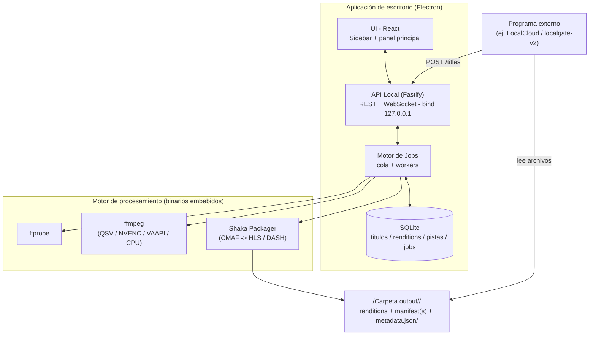
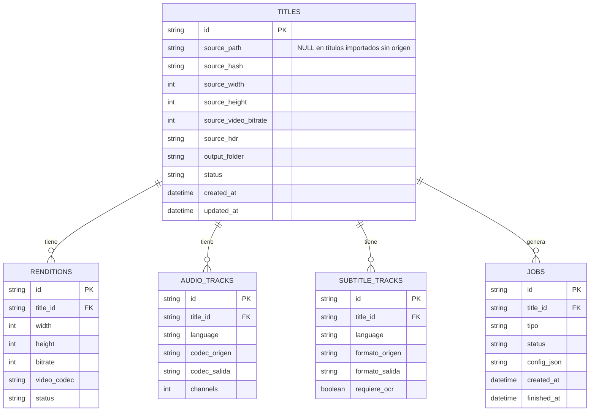
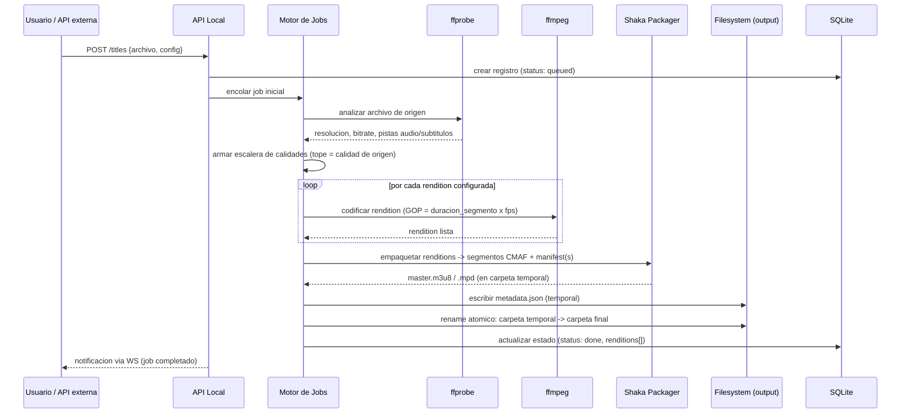
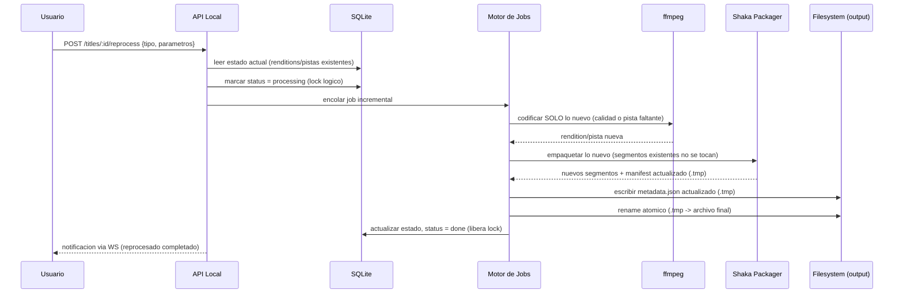

# Documentación Técnica — Motor de Transcodificación VOD

**Estado:** v1 implementada — documento de arquitectura de referencia. El uso, la integración y la referencia de la API están en el [README](../README.md).

---

## 1. Stack tecnológico propuesto

| Capa | Tecnología | Motivo |
|---|---|---|
| Shell de escritorio | Electron | Permite UI en React/JS (stack ya conocido) dentro de una ventana nativa, sin depender del navegador. Docker Desktop está construido con el mismo enfoque. |
| UI | React (o Next en modo estático) | Reutiliza conocimiento existente. |
| Backend embebido | Node.js (Fastify) | Corre dentro del mismo proceso/instalador de Electron; expone la API local. |
| Cola de jobs | Cola propia respaldada en SQLite (no BullMQ/Redis) | Al ser una app distribuible para "cualquier PC", no se puede depender de que el usuario tenga Redis corriendo. SQLite es un solo archivo, sin instalación externa. |
| Estado/persistencia | SQLite | Guarda títulos, renditions, pistas, jobs y su estado. |
| Análisis de origen | ffprobe | Detecta resolución, bitrate, códecs, pistas de audio/subtítulos del archivo de entrada. |
| Codificación | ffmpeg (con soporte QSV/NVENC/VAAPI + fallback CPU) | Genera cada rendition de video/audio. |
| Empaquetado | Shaka Packager (o Bento4 como alternativa) | Genera segmentos CMAF + manifiestos HLS y/o DASH desde un mismo set de renditions, sin duplicar el video. |
| Empaquetado del instalador | electron-builder | Genera instaladores para Windows/Mac/Linux con los binarios (ffmpeg, ffprobe, packager) incluidos. |

## 2. Arquitectura general



## 3. Modelo de datos (SQLite)



Notas:
- `TITLES.status`: `queued | processing | done | error`. Mientras esté en `processing`, no se admite otro job de reprocesado sobre el mismo título (lock lógico a nivel de fila).
- `JOBS.tipo`: `inicial | agregar_calidad | agregar_pista | reprocesar_completo`.
- `source_hash` permite detectar si el archivo de origen cambió entre un procesado y un reprocesado.

## 4. API local (REST + WebSocket)

| Método | Ruta | Descripción |
|---|---|---|
| POST | `/titles` | Registra un archivo (ruta local o multipart) y lo encola para procesamiento inicial |
| GET | `/titles` | Lista todos los títulos, con su estado actual |
| GET | `/titles/:id` | Detalle de un título: renditions, pistas de audio/subtítulos, estado |
| POST | `/titles/:id/reprocess` | Dispara un reprocesado incremental (`agregar_calidad`, `agregar_pista`, `reprocesar_completo`) |
| POST | `/titles/import` | Recorre la carpeta de salida: importa los títulos publicados que no estén en la base y revincula los que cambiaron de carpeta; devuelve `{ imported, relinked, skipped }` |
| PUT | `/titles/:id/source` | Vincula (o reemplaza) el archivo de origen de un título: `{ sourcePath }`, validado con ffprobe y por duración |
| DELETE | `/titles/:id` | Elimina un título y su carpeta de salida |
| GET | `/jobs` | Lista jobs activos y en cola |
| GET | `/jobs/:id` | Detalle/progreso de un job específico |
| WS | `/jobs/stream` | Canal en tiempo real de progreso (consumido por la UI y opcionalmente por sistemas externos) |
| GET | `/config` | Configuración actual (calidades, estándar, duración de segmento, carpeta output) |
| PUT | `/config` | Actualiza configuración |
| POST | `/config/api-token` | Regenera el token de acceso desde la red |
| GET | `/system` | Codificadores detectados, concurrencia, dirección en la que escucha la API y IPs de red del equipo |
| GET | `/logs` | Registro de acciones: filtros `level` (mínimo), `category`, `jobId`, `titleId`, `q`, paginación `before`/`limit`, `format=text` |
| GET | `/jobs/:id/log` | Salida completa de ffmpeg / Shaka Packager del job, en texto |

La API escucha únicamente en `127.0.0.1` por defecto — no expone el servicio a la red salvo que el usuario lo habilite explícitamente (`apiAccess: "lan"`, ver §12).

## 5. Flujo: procesamiento inicial de un título



## 6. Flujo: reprocesado incremental



**Por qué rename atómico y no bloqueo de carpeta:** un rename dentro del mismo directorio es atómico tanto en POSIX como en Windows — un lector externo nunca ve un archivo a medio escribir, recibe la versión anterior completa o la nueva completa. Los segmentos de video nunca se sobrescriben (cada rendition vive en su propia subcarpeta); solo el manifiesto raíz y el `metadata.json` se reemplazan de esta forma. Esto evita bloquear el acceso de consumidores externos durante el reprocesado.

## 7. Motor de codificación — reglas clave

- **No upscaling:** antes de codificar, `ffprobe` determina resolución y bitrate de origen. Cualquier calidad configurada que exceda esos valores se omite automáticamente para ese título.
- **HDR → SDR:** `ffprobe` identifica los orígenes HDR por la función de transferencia (`smpte2084` = PQ, `arib-std-b67` = HLG) y lee del primer fotograma el pico de brillo (MaxCLL, si no el de la pantalla de masterización; 1000 nits si no hay metadatos). En el encode se inserta una sola vez, antes del `split` a las calidades, la cadena `zscale` (linealización con 100 nits = 1.0 y primarios BT.709) → `tonemap=hable` con ese pico → `zscale` a BT.709 8 bits; las pistas quedan señalizadas como BT.709 (`VIDEO-RANGE=SDR` en HLS) y `metadata.json` lo refleja en `dynamicRange`. El filtro corre en CPU (≈1,8× el tiempo de codificación en 4K); con NVENC la decodificación pasa a NVDEC (`-hwaccel cuda`) para descargar la CPU, con vuelta automática a software si el códec no está soportado. Dolby Vision perfil 5 (base IPTPQc2, sin compatibilidad HDR10) se rechaza al encolar.
- **Segmento configurable + GOP:** la duración de segmento (default 6s) determina el tamaño de GOP en ffmpeg (`GOP = duración_segmento × fps`), para que los cortes de segmento caigan exactamente en un keyframe.
- **Audio:** se preservan todas las pistas. Códecs no compatibles con streaming (ej. DTS) se transcodifican a AAC o EAC3; códecs ya compatibles (AAC, AC3) se preservan sin recodificar cuando es posible.
- **Subtítulos:** pistas de texto (SRT/ASS) se convierten a WebVTT (o TTML para DASH). Pistas de imagen (PGS/VobSub) requieren un paso de OCR a texto — a definir como configuración por defecto (OCR vs. quemado en video).

## 8. Empaquetado (CMAF)

Shaka Packager recibe las renditions ya codificadas y genera segmentos en formato CMAF (fMP4), a partir de los cuales produce simultáneamente:
- Manifiesto HLS (`master.m3u8`) si está habilitado.
- Manifiesto DASH (`.mpd`) si está habilitado.

Al compartir el mismo set de segmentos, no se duplica el contenido de video por cada estándar de salida.

## 9. Metadata sidecar (`metadata.json`)

Archivo generado junto al manifiesto, pensado para que un sistema externo (ej. LocalCloud) no necesite parsear `.m3u8`/`.mpd` para saber qué contenido hay disponible. Contenido mínimo propuesto:

```json
{
  "titleId": "string",
  "duration": 0,
  "standard": ["hls", "dash"],
  "dynamicRange": { "source": "sdr | pq | hlg", "output": "sdr" },
  "source": { "path": "string", "sizeBytes": 0, "width": 0, "height": 0, "fps": 0, "codec": "string", "bitrate": 0 },
  "renditions": [{ "width": 0, "height": 0, "bitrate": 0 }],
  "audioTracks": [{ "language": "string", "codec": "string", "channels": 0, "sourceIndex": 0, "sourceCodec": "string" }],
  "subtitleTracks": [{ "language": "string", "format": "string", "sourceIndex": 0, "sourceFormat": "string" }],
  "updatedAt": "ISO-8601"
}
```

El bloque `source` y los campos `sourceIndex`/`sourceCodec`/`sourceFormat` hacen que la carpeta baste para reconstruir la biblioteca (`POST /titles/import`): un título importado recupera nombre, duración, calidades y pistas; si el archivo de origen sigue en su ruta, también su huella (`source_hash`). Los `metadata.json` anteriores a estos campos se importan igualmente, tomando el índice de origen del identificador de pista (`3_es_aac`, `e1_fr` = pista externa) y sin archivo de origen hasta que el usuario lo vincule.

## 10. Concurrencia y aceleración por hardware

- Al iniciar, el motor detecta qué aceleración por hardware está disponible en la máquina (QSV, NVENC, VAAPI) y cae a codificación por software (libx264/libx265) si no encuentra ninguna.
- Intel QSV no impone un límite artificial de sesiones concurrentes; NVIDIA (GeForce de consumo) sí ha tenido límites de driver en distintas generaciones — el número de jobs en paralelo debe ajustarse según el hardware detectado, no asumirse fijo.
- Sin aceleración de hardware, la concurrencia se limita según núcleos de CPU disponibles para evitar saturar la máquina.

## 11. Manejo de errores y atomicidad

- Cada job escribe su resultado en una carpeta temporal; solo se mueve/renombra a la ubicación final al completarse exitosamente.
- Si un job falla a mitad de camino, la carpeta temporal se descarta — el contenido final publicado nunca queda en un estado parcial o corrupto.
- Antes de encolar un job, se valida espacio en disco suficiente para las renditions configuradas.

## 11 bis. Registro de acciones

- Tabla `logs` (migración 007): `ts`, `level` (`debug|info|warn|error`), `category` (`app|api|config|titles|jobs|pipeline`), `message`, `job_id`, `title_id`, `context` (JSON). Se conservan las últimas 50 000 entradas; el `id` es `AUTOINCREMENT` para que la paginación hacia atrás (`before`) no se vea afectada por la poda.
- `AppLogger` (`src/server/logging/`) escribe cada entrada en `<datos>/logs/app.log` (rotación 10 MB × 3) desde el primer instante del arranque, antes de abrir la base de datos; las entradas previas se vuelcan a la tabla al abrirla. Cada entrada guardada se emite por el WebSocket como `log.entry`.
- La salida completa de ffmpeg y del Packager va a `<datos>/logs/jobs/<jobId>.log` (últimos 200 jobs; se borra con el título). Al fallar un job, la entrada de error incluye el paso, el error con su traza y las últimas 200 líneas de esa salida.
- Fuentes: hook `onResponse` de Fastify (peticiones que cambian estado y rechazos), rutas (títulos, configuración), runner (ciclo de vida del job, duración de cada paso) y el hook `onEvent` del pipeline (origen analizado, plan, comandos, codificación, empaquetado, publicación).

## 12. Seguridad

- La API local escucha en `127.0.0.1` por defecto. Las peticiones que llegan por loopback (la UI y los programas de la misma máquina) no se autentican: el uso local sigue siendo el modelo de confianza de v1.
- Acceso desde la red local, opcional (`apiAccess: "lan"` en la configuración; en la UI, *Permitir acceso desde la red local*): la API pasa a escuchar en `0.0.0.0` y exige a toda petición que no venga de loopback un token de 32 caracteres generado por la aplicación (`apiToken`). Se envía como `Authorization: Bearer <token>` o `X-Api-Key: <token>`; en el WebSocket `/jobs/stream` también se acepta `?token=`, porque los navegadores no pueden añadir cabeceras a un WebSocket.
- Sin token o con uno incorrecto la respuesta es `401`; con el acceso en modo local, cualquier petición externa recibe `403`. Los preflight CORS (`OPTIONS`) no se autentican.
- El token lo genera el servidor (nunca lo elige el cliente): se crea al habilitar el acceso por primera vez, se conserva al deshabilitarlo y se reemplaza con `POST /config/api-token`, lo que revoca el anterior de inmediato.
- Cambiar el modo de acceso cierra el servidor HTTP y lo vuelve a abrir en la nueva dirección sin interrumpir los jobs en curso; la UI reconecta su WebSocket sola. Si no se puede escuchar en la red, la API vuelve a `127.0.0.1` y lo registra en el log.
- El tráfico es HTTP sin cifrar: la opción está pensada para redes domésticas o de confianza.

## 13. Distribución

- Empaquetado con `electron-builder` para generar instaladores nativos (`.exe` NSIS para Windows, `.dmg` para Mac, `AppImage`/`.deb` para Linux).
- Binarios de ffmpeg, ffprobe y Shaka Packager embebidos en el instalador (no requieren instalación separada por parte del usuario).

## 14. Decisiones abiertas (pendientes de definir)

- Enfoque por defecto para subtítulos de imagen: ¿OCR automático o quemado en video?
- Política exacta de cuántos jobs correr en paralelo por tipo de hardware detectado.
- Si el `metadata.json` debe incluir también miniaturas/poster (fuera de alcance v1, pero queda como posible extensión).
